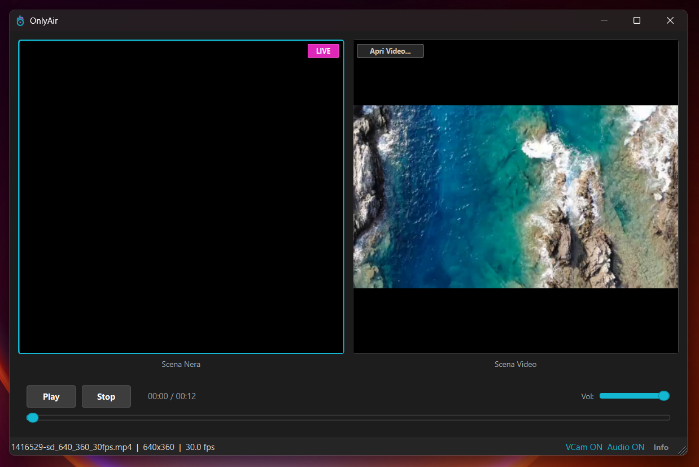

  

<h1 align="center">OnlyAir</h1>

  <strong>Virtual Camera & Audio for Video Calls</strong>

  <em>Stream pre-recorded videos as your webcam and microphone in any video call app</em>

---

  

---

## What is OnlyAir?

OnlyAir lets you use **any video file** as your webcam and microphone feed during video calls. Perfect for:

- **Presentations** — Show pre-recorded demos without screen sharing issues
- **Tutorials** — Play instructional videos as your camera feed
- **Consistent output** — Always look professional with prepared content
- **Privacy** — Use video content instead of your live camera

---

## Features

| Feature | Description |
|---------|-------------|
| **Virtual Camera** | Works with Zoom, Teams, Meet, Discord, Skype and more |
| **Virtual Audio** | Routes video audio to your microphone input |
| **Simple & Studio Modes** | Quick mode for easy use, Studio mode for full control |
| **Scene Transitions** | Smooth crossfade between black screen and video |
| **Multi-format Support** | MP4, AVI, MKV, MOV, WMV, WebM and more |
| **Drag & Drop** | Just drop your video file to start |
| **Bilingual** | English and Italian interface |
| **Fully Offline** | No internet required, works completely offline |

---

## How It Works

1. **Launch OnlyAir**
2. **Load your video** (drag & drop or click Open)
3. **Set your video call app:**
   - Camera: `OnlyAir Virtual Camera`
   - Microphone: `CABLE Output (VB-Audio Virtual Cable)`
4. **Press Play** — Your video is now your webcam!

---

## System Requirements

- Windows 10 or Windows 11 (64-bit)
- ~100 MB disk space
- No special hardware required

---

## Get OnlyAir

  <strong>Interested in OnlyAir?</strong>

  

  Contact <strong>@PuntoGcode</strong> on Telegram to get the program

---

## Screenshots

  

---

  OnlyAir — Your video, your camera

