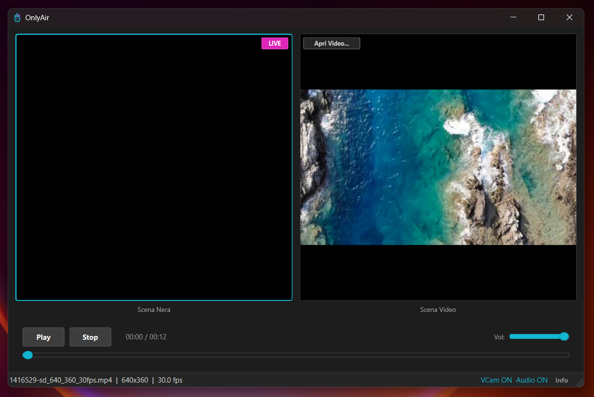

<p align="center">
  
</p>

<h1 align="center">OnlyAir</h1>

<p align="center">
  <strong>Virtual Camera & Audio for Video Calls</strong>
</p>

<p align="center">
  <a href="#features">Features</a> •
  <a href="#building-from-source">Build</a> •
  <a href="#usage">Usage</a> •
  <a href="#acknowledgments">Credits</a>
</p>

---

OnlyAir lets you stream pre-recorded videos as your webcam and microphone feed in any video conferencing application. Perfect for presentations, tutorials, or when you need consistent video output.



## Features

- **Virtual Camera** — Works with Zoom, Microsoft Teams, Google Meet, Discord, Skype, and any application that uses a webcam
- **Virtual Audio** — Routes video audio through VB-Cable virtual audio device to your microphone input
- **Scene Switching** — Smooth crossfade transitions between black screen and video content
- **Live Preview** — See exactly what's being broadcast with real-time thumbnail previews
- **Drag & Drop** — Simply drag video files onto the window to load them
- **Multi-format Support** — MP4, AVI, MKV, MOV, WMV, WebM and more
- **Bilingual Interface** — English and Italian language support
- **Fully Offline** — All dependencies included, no internet connection required

## Usage

### Quick Start

1. **Build and install** following the [Build](#building-from-source) instructions below
2. **Launch OnlyAir**
3. **Load a video** by clicking "Open Video" or dragging a file onto the window
4. **Configure your video call application:**
   - Set camera to: `OnlyAir Virtual Camera`
   - Set microphone to: `CABLE Output (VB-Audio Virtual Cable)`
5. **Click on the Video scene** to start streaming
6. **Click on the Black scene** to show a black screen (useful for breaks)

### Controls

| Control | Action |
|---------|--------|
| **Play** | Start/resume video playback |
| **Stop** | Stop playback and return to beginning |
| **Seek Bar** | Jump to any position in the video |
| **Volume** | Adjust audio output level |

### Keyboard Shortcuts

| Shortcut | Action |
|----------|--------|
| `Ctrl+O` | Open video file |
| `Ctrl+Q` | Quit application |

### Tips

- The **LIVE** badge indicates which scene is currently being broadcast
- You can switch scenes while a video call is active
- The virtual camera is always active when OnlyAir is running
- Use the Black scene when you need a moment away

## Building from Source

### Requirements

- Windows 10 or Windows 11 (64-bit)
- **Visual Studio 2022** with C++ Desktop Development workload
- **Qt 6.x** (Widgets, OpenGL, OpenGLWidgets modules)
- **CMake 3.20+**
- **Inno Setup 6** (for creating the installer)

### Dependencies

Before building, you need to download the following dependencies:

1. **FFmpeg** (LGPL shared libraries)
   - Download from [BtbN/FFmpeg-Builds](https://github.com/BtbN/FFmpeg-Builds/releases)
   - Extract to `third_party/ffmpeg/`

2. **VB-Cable** (Virtual Audio)
   - Download from [vb-audio.com/Cable](https://vb-audio.com/Cable/)
   - Place `VBCABLE_Setup_x64.exe` in `third_party/vbcable/`

Or run the setup script:
```powershell
powershell -ExecutionPolicy Bypass -File scripts/setup_dependencies.ps1
```

### Build Steps

```bash
# Clone the repository
git clone https://github.com/0xDevDav/OnlyAir.git
cd OnlyAir

# Configure (adjust Qt path as needed)
cmake -S . -B build -G "Visual Studio 17 2022" -A x64 ^
  -DQt6_DIR="C:/Qt/6.7.0/msvc2022_64/lib/cmake/Qt6"

# Build OnlyAir
cmake --build build --config Release --target OnlyAir

# Build Softcam virtual camera driver
msbuild third_party/softcam/softcam.sln /p:Configuration=Release /p:Platform=x64

# Copy softcam.dll to build output
copy third_party\softcam\x64\Release\softcam.dll build\bin\Release\
```

### Creating the Installer

```bash
"C:/Program Files (x86)/Inno Setup 6/ISCC.exe" installer/OnlyAirSetup.iss
```

The installer will be created at `installer/output/OnlyAirSetup-1.0.0.exe`

## Project Structure

```
OnlyAir/
├── src/app/                    # Application source code
│   ├── qt/                     # Qt UI components (MainWindow, ScenePanel, etc.)
│   ├── VideoPlayer.cpp         # FFmpeg-based video decoding
│   ├── AudioPlayer.cpp         # WASAPI audio output
│   ├── SceneManager.cpp        # Scene management & crossfade transitions
│   ├── Translator.cpp          # i18n support
│   └── Application.cpp         # Core application logic
├── third_party/
│   ├── softcam/                # Virtual camera driver (MIT License)
│   ├── ffmpeg/                 # FFmpeg libraries (LGPL)
│   └── vbcable/                # VB-Cable installer (Donationware)
├── installer/                  # Inno Setup scripts
├── resources/                  # Icons and assets
└── scripts/                    # Build helper scripts
```

## Acknowledgments

OnlyAir is built on the shoulders of giants. Huge thanks to the developers and maintainers of these amazing projects:

### Core Dependencies

- **[Softcam](https://github.com/tshino/softcam)** by [@tshino](https://github.com/tshino) — The virtual camera library that makes this project possible. A brilliant DirectShow-based solution for creating virtual webcams on Windows. (MIT License)

- **[FFmpeg](https://github.com/FFmpeg/FFmpeg)** — The legendary multimedia framework powering video decoding and audio processing. An indispensable tool for any media application. (LGPL)

- **[Qt 6](https://www.qt.io/)** — The cross-platform UI framework providing the modern, responsive interface. (LGPL)

- **[VB-Cable](https://vb-audio.com/Cable/)** by VB-Audio Software — The virtual audio cable solution enabling audio routing to video call applications. VB-Cable is free donationware — consider supporting the developers!

### Special Thanks

To the entire open-source community for making projects like this possible. Your contributions to free software benefit developers and users worldwide.

## License

This project is licensed under the **MIT License** — see the [LICENSE](LICENSE) file for details.

Third-party components are used under their respective licenses:
- Softcam: MIT License
- FFmpeg: LGPL
- Qt 6: LGPL
- VB-Cable: Donationware (free for personal use)

## Author

**DevDav** — [@0xDevDav](https://github.com/0xDevDav)

---

<p align="center">
  <sub>Built with Qt and FFmpeg</sub>
</p>
